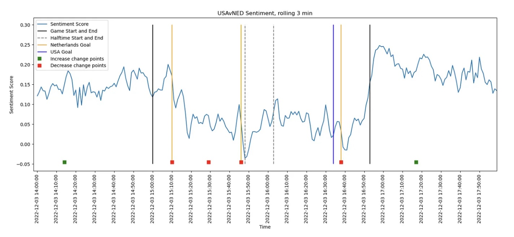
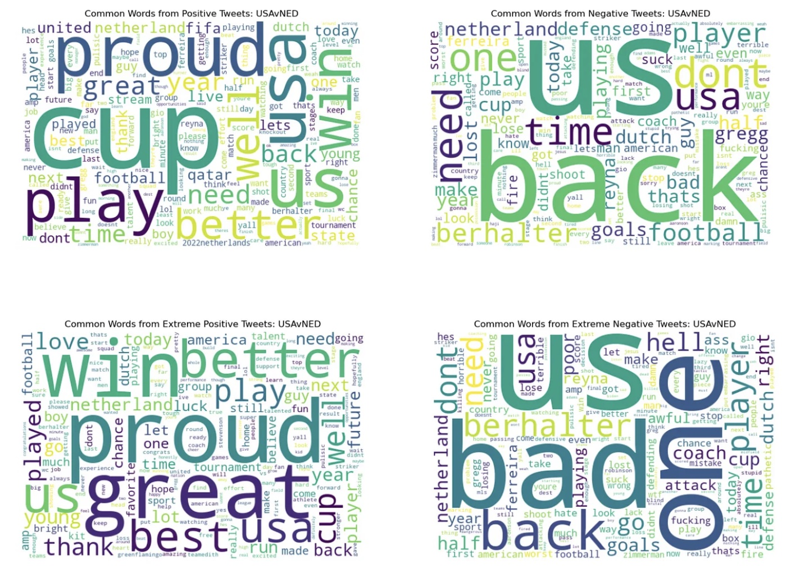
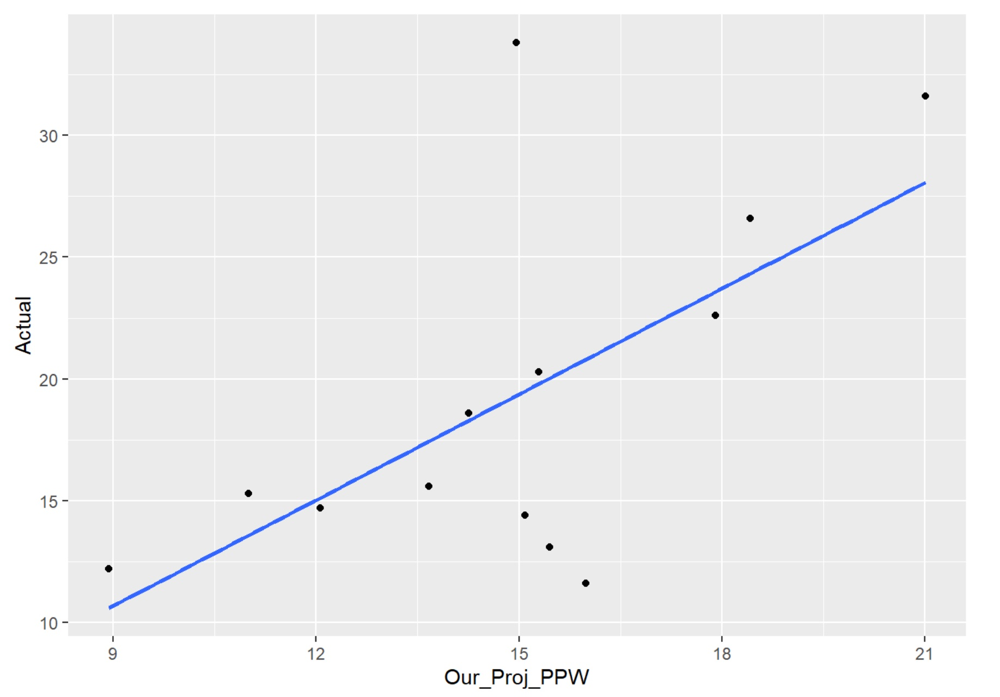
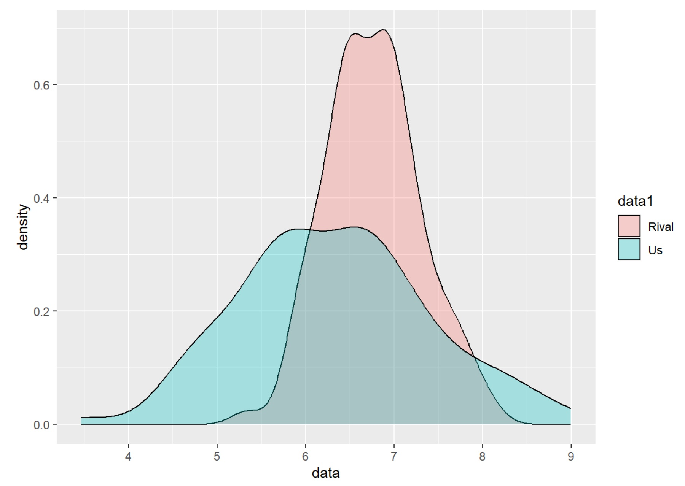

# Projects
## [“It’s Called VADER”: A Python Twitter Sentiment Analysis on USMNT Fans during the 2022 World Cup"](https://medium.com/hoyalytics/its-called-vader-a-python-twitter-sentiment-analysis-on-usmnt-fans-during-the-2022-world-cup-a8e08d479647) 

  
  

 
A concept I pioneered with Georgetown’s data analytics club, Hoyalytics, this collaborative capstone project tracked fan sentiment during the 2022 USMNT World Cup games. Our goal was to find insights about fan attitudes towards in-game events, offering a data-driven perspective to create a narrative behind the team’s journey. We scraped thousands of tweets from Twitter’s API and cleaned the data to conduct our sentiment analysis. We then performed a time series analysis to statistically detect changes in sentiment, which correlated with key game events. Our visualizations also offered evidence for sources of positive and negative sentiment surrounding the USMNT, particularly involving Coach Gregg Berhalter, young star Gio Reyna, and team captain Christian Pulisic. 

Consistent with our club’s mission to democratize data analytics education, we open-sourced our code on [GitHub](https://github.com/wcalandra5/USMNT_Sentiment_Analysis) and published a detailed walkthrough of the code and statistical theory used in the project.

## [My R Course for Beginners](https://github.com/wcalandra5/R_Course#r-education-course-notes)  

  
  

  
Built from scratch to inspire my Georgetown peers to learn data analytics, this six lecture R course introduces people to R programming, statistical principles, and data ethics. Taught from ground zero, the course is designed to equip anyone with fundamental skills to start building their own data analytics projects. I enjoyed teaching this course to ~50 of my peers during 3 semesters, which helped develop enthusiasm for data analysis in addition to core competencies for both Hoyalytics and Georgetown Baseball. Attached are my lecture notes that helped guide my lectures and provide resources for my peers.